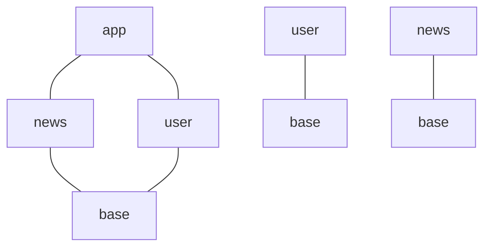

### 组件化项目

使用dependencies方式



在组件化多模块项目中，app模块只在最终打包的时候直接依赖user,news模块，当user,news作为单独APP来运行时与app不存在依赖关系了，所以Appcomponent不能放在app模块中了这种情况下应该放在base中。

然而如果放在base模块中，base没有user,news的依赖，无法使用注册UserComponent和NewsComponent所以这时候不能再使用SubComponent方法来实现依赖了

这种情况下只能使用dependencies方式

base模块中

```kotlin
@Module
class AppModule {

}
```

```kotlin
@Singleton
@Component(modules = [AppModule::class])
interface AppComponent {
    @Component.Factory
    interface Factory {
        fun create(@BindsInstance context: Context): AppComponent
    }
}
```

```kotlin
class BaseApplication : Application() {
    lateinit var appComponent: AppComponent
    override fun onCreate() {
        super.onCreate()
        instance = this
        appComponent = DaggerAppComponent.factory().create(this)
    }

    companion object {
        lateinit var instance: BaseApplication
    }
}
```

这里AppComponent放在BaseApplication中,这样user,news模块可以直接使用

user模块

```kotlin
@Module
class UserModule {
}
```

```kotlin
@UserScope
@Component(modules = [UserModule::class], dependencies = [AppComponent::class])
interface UserComponent {
}
```

news模块

```kotlin
@Module
class NewsModule {
}
```

```kotlin
@NewsScope
@Component(modules = [NewsModule::class], dependencies = [AppComponent::class])
interface NewsComponent {
}
```

要生成NewsComponent和UserComponent必须先得到AppComponent,通过以下方法来创建

```kotlin
 val newsComponent = DaggerNewsComponent.builder()
            .appComponent(BaseApplication.instance.appComponent)
            .build()
 val userComponent = DaggerUserComponent.builder()
            .appComponent(BaseApplication.instance.appComponent)
            .build()
```

```kotlin
object NewsComponentHolder {
    val newsComponent: NewsComponent by lazy {
        DaggerNewsComponent.builder()
            .appComponent(BaseApplication.instance.appComponent)
            .build()
    }
}
object UserComponentHolder {
    val userComponent: UserComponent by lazy {
        DaggerUserComponent.builder()
            .appComponent(BaseApplication.instance.appComponent)
            .build()
    }
}
```

